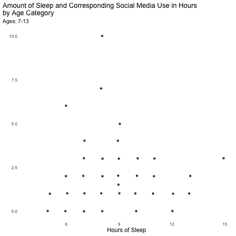
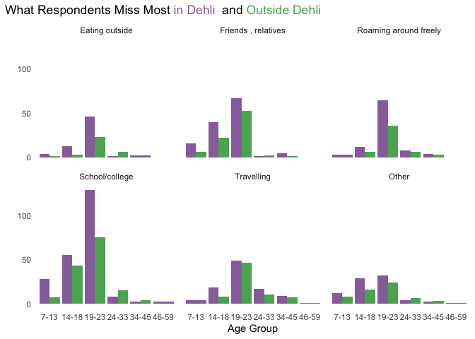
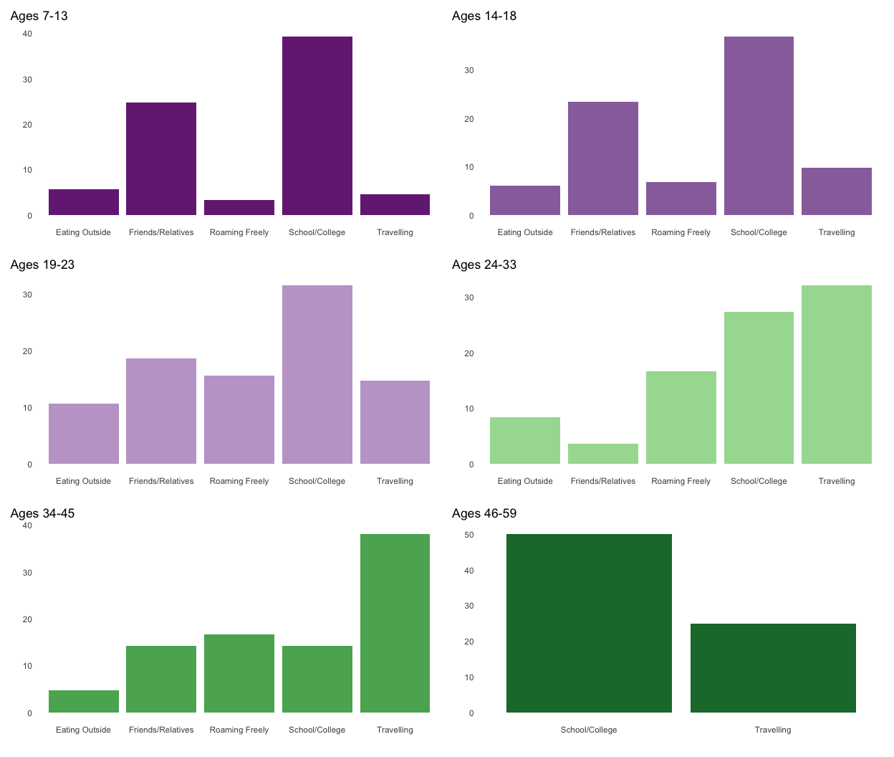

## **Introduction**

### **COVID-19 in the United States**

Our group was interested in exploring the repercussions of the COVID-19 pandemic on young people, and especially students. In initial research, we found that within the United States, the rise of remote learning has called for additional attention on students’ mental health as they experience a lack of social interaction, less direct support from teachers, and difficulty focusing at home. Aside from academics, the mental well-being of all youth in general has also been negatively affected as children and their families are asked to self-quarantine and in some cases, leave their jobs. Health experts are now concerned about the mental health conditions for our youth in the long run. They believe that experiencing and living in these tough situations for an extended amount of time can cause children to have anxiety and depression which is why we need to start paying close attention to negative impacts of COVID-19 on mental health.  For more information regarding this issue, you may read the article provided in this [link](https://www.writingcity.com/how-remote-learning-affects-students-mental-health.html).  

### **Data Collection**

We intended to look for data that investigated the effects of COVID-19 in the United States, but had difficulty finding a data set that had an adequate amount or type of data for our project. We then broadened the scope of our search and were interested to look outside of the United States. As Americans, we have seen and experienced the pandemic’s implications on mental health within the United States, but it leaves us quite curious about the present circumstances elsewhere. While searching for new research and data sets, we stumbled upon a relatively recent research done in Delhi, the capital territory of India called "COVID-19 and its impact on education, social life and mental health of students: A Survey". 

### **Implications in India**

Data was collected from subjects living in the National Capital Region (NCR) which encompasses both Delhi and its surrounding area, as well as outside of this region. In this study, researchers looked at different age-groups of a total of 1,182 subjects, ages ranging from 7 to 59 years old, and how several aspects of their lives were affected after the lockdown. Additionally, they recorded the different coping mechanisms adopted due to such sudden changes. The various variables such as learning hours for online classes and self-study, duration of sleep, time spent on fitness and sleep were recorded and analyzed as factors related to mental health. Although the effect on students’ education, social life, physical health, and mental well-being was expected, this research suggests that the public should take necessary measures to prevent psychological problems and improve students’ experiences in and outside of academics, for our current results are not meeting the expectations of the initial government policies. For specific details on the demographics, objectives, and methods of this study, please read the research paper linked [here](https://www.researchgate.net/publication/347935769_COVID-19_and_its_impact_on_education_social_life_and_mental_health_of_students_A_Survey). 

Although the researchers in this study did a phenomenal job at creating, designing, and interpreting their own plots, we decided to ask different questions and explore our own interests by using the same data set while still acknowledging their remarkable findings. Overall, we wondered how has COVID-19 affected mental health among students? How do factors like social connection, sleep and social media use affect student life and class activities? 

## **Demographics**

### Age Breakdown
Before exploring the data set, it's important to first acknowledge that there is indeed a demographic imbalance. Of the 1,182 respondents, the research paper states that 84.3% of those subjects were 7 to 22 years of age with the mean age being 20.16 years old. This bar plot visually demonstrates that most of the data comes from college-aged respondents. As, the aim of this study was to research COVID-19 implications on the education, social life, and mental health of students, it makes sense that there are so many respondents in this age range.


```{=html}
<div id="htmlwidget-2c0a747b4c04bf486361" style="width:672px;height:480px;" class="plotly html-widget"></div>
<script type="application/json" data-for="htmlwidget-2c0a747b4c04bf486361">{"x":{"data":[{"orientation":"v","width":[0.9,0.899999999999999,0.899999999999999,0.899999999999999,0.899999999999999,0.899999999999999,0.899999999999999,0.899999999999999,0.899999999999999,0.899999999999999,0.899999999999999,0.899999999999999,0.899999999999999,0.899999999999999,0.899999999999999,0.899999999999999,0.899999999999999,0.899999999999999,0.899999999999999,0.899999999999999,0.899999999999999,0.899999999999999,0.899999999999999,0.899999999999999,0.899999999999999,0.900000000000002,0.900000000000006,0.900000000000006,0.900000000000006,0.900000000000006,0.900000000000006,0.900000000000006,0.900000000000006,0.900000000000006,0.900000000000006,0.900000000000006,0.900000000000006,0.900000000000006,0.900000000000006,0.900000000000006,0.900000000000006,0.900000000000006],"base":[0,0,0,0,0,0,0,0,0,0,0,0,0,0,0,0,0,0,0,0,0,0,0,0,0,0,0,0,0,0,0,0,0,0,0,0,0,0,0,0,0,0],"x":[7,8,9,10,11,12,13,14,15,16,17,18,19,20,21,22,23,24,25,26,27,28,29,30,31,32,33,34,35,36,37,38,39,40,42,43,44,45,46,50,52,59],"y":[1,2,2,4,6,29,48,48,37,67,58,66,138,211,188,93,44,23,12,12,6,7,4,8,4,10,5,10,4,5,2,4,1,14,1,2,1,1,1,1,1,1],"text":["count:   1<br />Age:  7","count:   2<br />Age:  8","count:   2<br />Age:  9","count:   4<br />Age: 10","count:   6<br />Age: 11","count:  29<br />Age: 12","count:  48<br />Age: 13","count:  48<br />Age: 14","count:  37<br />Age: 15","count:  67<br />Age: 16","count:  58<br />Age: 17","count:  66<br />Age: 18","count: 138<br />Age: 19","count: 211<br />Age: 20","count: 188<br />Age: 21","count:  93<br />Age: 22","count:  44<br />Age: 23","count:  23<br />Age: 24","count:  12<br />Age: 25","count:  12<br />Age: 26","count:   6<br />Age: 27","count:   7<br />Age: 28","count:   4<br />Age: 29","count:   8<br />Age: 30","count:   4<br />Age: 31","count:  10<br />Age: 32","count:   5<br />Age: 33","count:  10<br />Age: 34","count:   4<br />Age: 35","count:   5<br />Age: 36","count:   2<br />Age: 37","count:   4<br />Age: 38","count:   1<br />Age: 39","count:  14<br />Age: 40","count:   1<br />Age: 42","count:   2<br />Age: 43","count:   1<br />Age: 44","count:   1<br />Age: 45","count:   1<br />Age: 46","count:   1<br />Age: 50","count:   1<br />Age: 52","count:   1<br />Age: 59"],"type":"bar","marker":{"autocolorscale":false,"color":"rgba(231,212,232,1)","line":{"width":1.88976377952756,"color":"rgba(153,112,171,1)"}},"showlegend":false,"xaxis":"x","yaxis":"y","hoverinfo":"text","frame":null}],"layout":{"margin":{"t":43.7625570776256,"r":7.30593607305936,"b":25.5707762557078,"l":28.4931506849315},"font":{"color":"rgba(0,0,0,1)","family":"","size":14.6118721461187},"title":{"text":"Number of Survey Respondents by Age","font":{"color":"rgba(0,0,0,1)","family":"","size":17.5342465753425},"x":0,"xref":"paper"},"xaxis":{"domain":[0,1],"automargin":true,"type":"linear","autorange":false,"range":[3.905,62.095],"tickmode":"array","ticktext":["5","10","15","20","25","30","35","40","45","50","55","60"],"tickvals":[5,10,15,20,25,30,35,40,45,50,55,60],"categoryorder":"array","categoryarray":["5","10","15","20","25","30","35","40","45","50","55","60"],"nticks":null,"ticks":"","tickcolor":null,"ticklen":3.65296803652968,"tickwidth":0,"showticklabels":true,"tickfont":{"color":"rgba(77,77,77,1)","family":"","size":11.689497716895},"tickangle":-0,"showline":false,"linecolor":null,"linewidth":0,"showgrid":false,"gridcolor":null,"gridwidth":0,"zeroline":false,"anchor":"y","title":{"text":"","font":{"color":"rgba(0,0,0,1)","family":"","size":14.6118721461187}},"hoverformat":".2f"},"yaxis":{"domain":[0,1],"automargin":true,"type":"linear","autorange":false,"range":[-10.55,221.55],"tickmode":"array","ticktext":["0","50","100","150","200"],"tickvals":[0,50,100,150,200],"categoryorder":"array","categoryarray":["0","50","100","150","200"],"nticks":null,"ticks":"","tickcolor":null,"ticklen":3.65296803652968,"tickwidth":0,"showticklabels":true,"tickfont":{"color":"rgba(77,77,77,1)","family":"","size":11.689497716895},"tickangle":-0,"showline":false,"linecolor":null,"linewidth":0,"showgrid":false,"gridcolor":null,"gridwidth":0,"zeroline":false,"anchor":"x","title":{"text":"","font":{"color":"rgba(0,0,0,1)","family":"","size":14.6118721461187}},"hoverformat":".2f"},"shapes":[{"type":"rect","fillcolor":null,"line":{"color":null,"width":0,"linetype":[]},"yref":"paper","xref":"paper","x0":0,"x1":1,"y0":0,"y1":1}],"showlegend":false,"legend":{"bgcolor":null,"bordercolor":null,"borderwidth":0,"font":{"color":"rgba(0,0,0,1)","family":"","size":11.689497716895}},"hovermode":"closest","barmode":"relative"},"config":{"doubleClick":"reset","showSendToCloud":false},"source":"A","attrs":{"93bf676d6094":{"x":{},"type":"bar"}},"cur_data":"93bf676d6094","visdat":{"93bf676d6094":["function (y) ","x"]},"highlight":{"on":"plotly_click","persistent":false,"dynamic":false,"selectize":false,"opacityDim":0.2,"selected":{"opacity":1},"debounce":0},"shinyEvents":["plotly_hover","plotly_click","plotly_selected","plotly_relayout","plotly_brushed","plotly_brushing","plotly_clickannotation","plotly_doubleclick","plotly_deselect","plotly_afterplot","plotly_sunburstclick"],"base_url":"https://plot.ly"},"evals":[],"jsHooks":[]}</script>
```

Because of the demographic imbalance, we split the respondents into age groups. The groupings were based partly on what we considered to be a tradition age for education levels and partly based on life stages. For respondents in the 7 to 23 age range, we can guess what level of schooling they are in based solely on age. However, for older respondents, this is not so simple. Thus, we broke up the older respondents into what we thought of as different life stages. These topics are big ideas to explore, and to get a more accurate picture of education and mental health we wanted to break the age down into groups by age level.


```{=html}
<style>html {
  font-family: -apple-system, BlinkMacSystemFont, 'Segoe UI', Roboto, Oxygen, Ubuntu, Cantarell, 'Helvetica Neue', 'Fira Sans', 'Droid Sans', Arial, sans-serif;
}

#mkumeidbpl .gt_table {
  display: table;
  border-collapse: collapse;
  margin-left: auto;
  margin-right: auto;
  color: #333333;
  font-size: 16px;
  font-weight: normal;
  font-style: normal;
  background-color: #FFFFFF;
  width: auto;
  border-top-style: solid;
  border-top-width: 2px;
  border-top-color: #A8A8A8;
  border-right-style: none;
  border-right-width: 2px;
  border-right-color: #D3D3D3;
  border-bottom-style: solid;
  border-bottom-width: 2px;
  border-bottom-color: #A8A8A8;
  border-left-style: none;
  border-left-width: 2px;
  border-left-color: #D3D3D3;
}

#mkumeidbpl .gt_heading {
  background-color: #FFFFFF;
  text-align: center;
  border-bottom-color: #FFFFFF;
  border-left-style: none;
  border-left-width: 1px;
  border-left-color: #D3D3D3;
  border-right-style: none;
  border-right-width: 1px;
  border-right-color: #D3D3D3;
}

#mkumeidbpl .gt_title {
  color: #333333;
  font-size: 125%;
  font-weight: initial;
  padding-top: 4px;
  padding-bottom: 4px;
  border-bottom-color: #FFFFFF;
  border-bottom-width: 0;
}

#mkumeidbpl .gt_subtitle {
  color: #333333;
  font-size: 85%;
  font-weight: initial;
  padding-top: 0;
  padding-bottom: 4px;
  border-top-color: #FFFFFF;
  border-top-width: 0;
}

#mkumeidbpl .gt_bottom_border {
  border-bottom-style: solid;
  border-bottom-width: 2px;
  border-bottom-color: #D3D3D3;
}

#mkumeidbpl .gt_col_headings {
  border-top-style: solid;
  border-top-width: 2px;
  border-top-color: #D3D3D3;
  border-bottom-style: solid;
  border-bottom-width: 2px;
  border-bottom-color: #D3D3D3;
  border-left-style: none;
  border-left-width: 1px;
  border-left-color: #D3D3D3;
  border-right-style: none;
  border-right-width: 1px;
  border-right-color: #D3D3D3;
}

#mkumeidbpl .gt_col_heading {
  color: #333333;
  background-color: #FFFFFF;
  font-size: 100%;
  font-weight: normal;
  text-transform: inherit;
  border-left-style: none;
  border-left-width: 1px;
  border-left-color: #D3D3D3;
  border-right-style: none;
  border-right-width: 1px;
  border-right-color: #D3D3D3;
  vertical-align: bottom;
  padding-top: 5px;
  padding-bottom: 6px;
  padding-left: 5px;
  padding-right: 5px;
  overflow-x: hidden;
}

#mkumeidbpl .gt_column_spanner_outer {
  color: #333333;
  background-color: #FFFFFF;
  font-size: 100%;
  font-weight: normal;
  text-transform: inherit;
  padding-top: 0;
  padding-bottom: 0;
  padding-left: 4px;
  padding-right: 4px;
}

#mkumeidbpl .gt_column_spanner_outer:first-child {
  padding-left: 0;
}

#mkumeidbpl .gt_column_spanner_outer:last-child {
  padding-right: 0;
}

#mkumeidbpl .gt_column_spanner {
  border-bottom-style: solid;
  border-bottom-width: 2px;
  border-bottom-color: #D3D3D3;
  vertical-align: bottom;
  padding-top: 5px;
  padding-bottom: 6px;
  overflow-x: hidden;
  display: inline-block;
  width: 100%;
}

#mkumeidbpl .gt_group_heading {
  padding: 8px;
  color: #333333;
  background-color: #FFFFFF;
  font-size: 100%;
  font-weight: initial;
  text-transform: inherit;
  border-top-style: solid;
  border-top-width: 2px;
  border-top-color: #D3D3D3;
  border-bottom-style: solid;
  border-bottom-width: 2px;
  border-bottom-color: #D3D3D3;
  border-left-style: none;
  border-left-width: 1px;
  border-left-color: #D3D3D3;
  border-right-style: none;
  border-right-width: 1px;
  border-right-color: #D3D3D3;
  vertical-align: middle;
}

#mkumeidbpl .gt_empty_group_heading {
  padding: 0.5px;
  color: #333333;
  background-color: #FFFFFF;
  font-size: 100%;
  font-weight: initial;
  border-top-style: solid;
  border-top-width: 2px;
  border-top-color: #D3D3D3;
  border-bottom-style: solid;
  border-bottom-width: 2px;
  border-bottom-color: #D3D3D3;
  vertical-align: middle;
}

#mkumeidbpl .gt_from_md > :first-child {
  margin-top: 0;
}

#mkumeidbpl .gt_from_md > :last-child {
  margin-bottom: 0;
}

#mkumeidbpl .gt_row {
  padding-top: 8px;
  padding-bottom: 8px;
  padding-left: 5px;
  padding-right: 5px;
  margin: 10px;
  border-top-style: solid;
  border-top-width: 1px;
  border-top-color: #D3D3D3;
  border-left-style: none;
  border-left-width: 1px;
  border-left-color: #D3D3D3;
  border-right-style: none;
  border-right-width: 1px;
  border-right-color: #D3D3D3;
  vertical-align: middle;
  overflow-x: hidden;
}

#mkumeidbpl .gt_stub {
  color: #333333;
  background-color: #FFFFFF;
  font-size: 100%;
  font-weight: initial;
  text-transform: inherit;
  border-right-style: solid;
  border-right-width: 2px;
  border-right-color: #D3D3D3;
  padding-left: 12px;
}

#mkumeidbpl .gt_summary_row {
  color: #333333;
  background-color: #FFFFFF;
  text-transform: inherit;
  padding-top: 8px;
  padding-bottom: 8px;
  padding-left: 5px;
  padding-right: 5px;
}

#mkumeidbpl .gt_first_summary_row {
  padding-top: 8px;
  padding-bottom: 8px;
  padding-left: 5px;
  padding-right: 5px;
  border-top-style: solid;
  border-top-width: 2px;
  border-top-color: #D3D3D3;
}

#mkumeidbpl .gt_grand_summary_row {
  color: #333333;
  background-color: #FFFFFF;
  text-transform: inherit;
  padding-top: 8px;
  padding-bottom: 8px;
  padding-left: 5px;
  padding-right: 5px;
}

#mkumeidbpl .gt_first_grand_summary_row {
  padding-top: 8px;
  padding-bottom: 8px;
  padding-left: 5px;
  padding-right: 5px;
  border-top-style: double;
  border-top-width: 6px;
  border-top-color: #D3D3D3;
}

#mkumeidbpl .gt_striped {
  background-color: rgba(128, 128, 128, 0.05);
}

#mkumeidbpl .gt_table_body {
  border-top-style: solid;
  border-top-width: 2px;
  border-top-color: #D3D3D3;
  border-bottom-style: solid;
  border-bottom-width: 2px;
  border-bottom-color: #D3D3D3;
}

#mkumeidbpl .gt_footnotes {
  color: #333333;
  background-color: #FFFFFF;
  border-bottom-style: none;
  border-bottom-width: 2px;
  border-bottom-color: #D3D3D3;
  border-left-style: none;
  border-left-width: 2px;
  border-left-color: #D3D3D3;
  border-right-style: none;
  border-right-width: 2px;
  border-right-color: #D3D3D3;
}

#mkumeidbpl .gt_footnote {
  margin: 0px;
  font-size: 90%;
  padding: 4px;
}

#mkumeidbpl .gt_sourcenotes {
  color: #333333;
  background-color: #FFFFFF;
  border-bottom-style: none;
  border-bottom-width: 2px;
  border-bottom-color: #D3D3D3;
  border-left-style: none;
  border-left-width: 2px;
  border-left-color: #D3D3D3;
  border-right-style: none;
  border-right-width: 2px;
  border-right-color: #D3D3D3;
}

#mkumeidbpl .gt_sourcenote {
  font-size: 90%;
  padding: 4px;
}

#mkumeidbpl .gt_left {
  text-align: left;
}

#mkumeidbpl .gt_center {
  text-align: center;
}

#mkumeidbpl .gt_right {
  text-align: right;
  font-variant-numeric: tabular-nums;
}

#mkumeidbpl .gt_font_normal {
  font-weight: normal;
}

#mkumeidbpl .gt_font_bold {
  font-weight: bold;
}

#mkumeidbpl .gt_font_italic {
  font-style: italic;
}

#mkumeidbpl .gt_super {
  font-size: 65%;
}

#mkumeidbpl .gt_footnote_marks {
  font-style: italic;
  font-size: 65%;
}
</style>
<div id="mkumeidbpl" style="overflow-x:auto;overflow-y:auto;width:auto;height:auto;"><table class="gt_table">
  <thead class="gt_header">
    <tr>
      <th colspan="3" class="gt_heading gt_title gt_font_normal" style>Respondents by Age Group</th>
    </tr>
    <tr>
      <th colspan="3" class="gt_heading gt_subtitle gt_font_normal gt_bottom_border" style></th>
    </tr>
  </thead>
  <thead class="gt_col_headings">
    <tr>
      <th class="gt_col_heading gt_columns_bottom_border gt_left" rowspan="1" colspan="1">Age</th>
      <th class="gt_col_heading gt_columns_bottom_border gt_center" rowspan="1" colspan="1">Respondents</th>
      <th class="gt_col_heading gt_columns_bottom_border gt_right" rowspan="1" colspan="1">Proportion</th>
    </tr>
  </thead>
  <tbody class="gt_table_body">
    <tr>
      <td class="gt_row gt_left gt_stub">7-13</td>
      <td class="gt_row gt_center">92</td>
      <td class="gt_row gt_right">7.783&percnt;</td>
    </tr>
    <tr>
      <td class="gt_row gt_left gt_stub">14-18</td>
      <td class="gt_row gt_center">276</td>
      <td class="gt_row gt_right">23.350&percnt;</td>
    </tr>
    <tr>
      <td class="gt_row gt_left gt_stub">19-23</td>
      <td class="gt_row gt_center">674</td>
      <td class="gt_row gt_right">57.022&percnt;</td>
    </tr>
    <tr>
      <td class="gt_row gt_left gt_stub">24-33</td>
      <td class="gt_row gt_center">91</td>
      <td class="gt_row gt_right">7.699&percnt;</td>
    </tr>
    <tr>
      <td class="gt_row gt_left gt_stub">34-45</td>
      <td class="gt_row gt_center">45</td>
      <td class="gt_row gt_right">3.807&percnt;</td>
    </tr>
    <tr>
      <td class="gt_row gt_left gt_stub">46-59</td>
      <td class="gt_row gt_center">4</td>
      <td class="gt_row gt_right">0.338&percnt;</td>
    </tr>
    <tr>
      <td class="gt_row gt_stub gt_right gt_grand_summary_row gt_first_grand_summary_row">total</td>
      <td class="gt_row gt_center gt_grand_summary_row gt_first_grand_summary_row">1,182</td>
      <td class="gt_row gt_right gt_grand_summary_row gt_first_grand_summary_row">&mdash;</td>
    </tr>
  </tbody>
  
  
</table></div>
```

<br>

### Region

Just as we observed with the previous plot, the number of respondents per region of residence also differs. This plot displays that there is indeed quite a significant difference between Delhi-NCR respondents and respondents living outside of the Delhi-NCR. Although the online-survey was originally aimed at institutions within the Delhi-NCR region, a significant number of responses from outside of Delhi-NCR was received, for distance-learning regulations forced many students to move out of homes and institutions to reside elsewhere. Of the total number of respondents, 38.3% were living outside of the Delhi-NCR.

<br>


```{=html}
<div id="htmlwidget-7a6f4b5e8073b086f77f" style="width:672px;height:480px;" class="plotly html-widget"></div>
<script type="application/json" data-for="htmlwidget-7a6f4b5e8073b086f77f">{"x":{"data":[{"orientation":"v","width":[0.9,0.9],"base":[0,0],"x":[1,2],"y":[721,461],"text":["count: 721<br />Region: Delhi-NCR","count: 461<br />Region: Outside Delhi-NCR"],"type":"bar","marker":{"autocolorscale":false,"color":"rgba(231,212,232,1)","line":{"width":1.88976377952756,"color":"transparent"}},"showlegend":false,"xaxis":"x","yaxis":"y","hoverinfo":"text","frame":null}],"layout":{"margin":{"t":43.7625570776256,"r":7.30593607305936,"b":25.5707762557078,"l":28.4931506849315},"font":{"color":"rgba(0,0,0,1)","family":"","size":14.6118721461187},"title":{"text":"Number of Survey Respondents by Region","font":{"color":"rgba(0,0,0,1)","family":"","size":17.5342465753425},"x":0,"xref":"paper"},"xaxis":{"domain":[0,1],"automargin":true,"type":"linear","autorange":false,"range":[0.4,2.6],"tickmode":"array","ticktext":["Delhi-NCR","Outside Delhi-NCR"],"tickvals":[1,2],"categoryorder":"array","categoryarray":["Delhi-NCR","Outside Delhi-NCR"],"nticks":null,"ticks":"","tickcolor":null,"ticklen":3.65296803652968,"tickwidth":0,"showticklabels":true,"tickfont":{"color":"rgba(77,77,77,1)","family":"","size":11.689497716895},"tickangle":-0,"showline":false,"linecolor":null,"linewidth":0,"showgrid":false,"gridcolor":null,"gridwidth":0,"zeroline":false,"anchor":"y","title":{"text":"","font":{"color":"rgba(0,0,0,1)","family":"","size":14.6118721461187}},"hoverformat":".2f"},"yaxis":{"domain":[0,1],"automargin":true,"type":"linear","autorange":false,"range":[-36.05,757.05],"tickmode":"array","ticktext":["0","200","400","600"],"tickvals":[0,200,400,600],"categoryorder":"array","categoryarray":["0","200","400","600"],"nticks":null,"ticks":"","tickcolor":null,"ticklen":3.65296803652968,"tickwidth":0,"showticklabels":true,"tickfont":{"color":"rgba(77,77,77,1)","family":"","size":11.689497716895},"tickangle":-0,"showline":false,"linecolor":null,"linewidth":0,"showgrid":false,"gridcolor":null,"gridwidth":0,"zeroline":false,"anchor":"x","title":{"text":"","font":{"color":"rgba(0,0,0,1)","family":"","size":14.6118721461187}},"hoverformat":".2f"},"shapes":[{"type":"rect","fillcolor":null,"line":{"color":null,"width":0,"linetype":[]},"yref":"paper","xref":"paper","x0":0,"x1":1,"y0":0,"y1":1}],"showlegend":false,"legend":{"bgcolor":null,"bordercolor":null,"borderwidth":0,"font":{"color":"rgba(0,0,0,1)","family":"","size":11.689497716895}},"hovermode":"closest","barmode":"relative"},"config":{"doubleClick":"reset","showSendToCloud":false},"source":"A","attrs":{"93bf39031e9d":{"x":{},"type":"bar"}},"cur_data":"93bf39031e9d","visdat":{"93bf39031e9d":["function (y) ","x"]},"highlight":{"on":"plotly_click","persistent":false,"dynamic":false,"selectize":false,"opacityDim":0.2,"selected":{"opacity":1},"debounce":0},"shinyEvents":["plotly_hover","plotly_click","plotly_selected","plotly_relayout","plotly_brushed","plotly_brushing","plotly_clickannotation","plotly_doubleclick","plotly_deselect","plotly_afterplot","plotly_sunburstclick"],"base_url":"https://plot.ly"},"evals":[],"jsHooks":[]}</script>
```

<p>&nbsp;</p>


### Class Time 

This plot compares the median number of hours spent in class by different age groups. For the sole purpose of this study, it is important to draw attention to how many hours students are spending sitting in front of a screen each day. From this plot, we can observe that respondents within the 7-13 and 14-18 age-groups spend the most time in class per day. The researchers emphasized that different variables (time spent on online class, self-study,fitness, sleep, and social media) changes with different age distributions. Average time spent in class and age-group was one of the relationships that were inversely proportional; As age-group value increases, the average number of hours spent online starts to decrease.  

<!-- -->


## **Social Media Use, Sleep and Mental Health Outcomes **

In a recent study examining the relationship between sleep and mental health and sleep in college students, researchers found that different mental health symptoms had different patterns of association with poor sleep. They found an association between anxiety and depression symptoms and sleep, but found that mental health conditions only affected certain effects of poor sleep. This study also emphasizes that the effects of poor mental health could be exacerbated by inadequate sleeping hours or poor sleep. Previous research has shown that improving sleep for students may also improve mood. (Becker et al., 2018).  

A correlational study from 2018 examined the association of outcomes of social media use in young adults such as general mental health symptoms, loneliness, suicidal thoughts, and a change in empathy, and found that concerns regarding social media use in young adults may be misplaced. Though organizations such as the Royal Society for public health have reported evidence for links between social media use and poor mental health, this particular study did not find proof of an association. This study pointed out the difference between use of social media on mental health effects. If social media was used for negative social comparison this could lead to depression, but that authentic self-presentation could be associated with positive mental health effects. The 2018 study also stated that time spent with social media or exposure alone is not a good indicator of mental health, but instead that how the time was spent is better for analysis and identifying problems (Berryman, Ferguson, and Negy, 2018).  

In the graph below we seek to examine the relationship with between time spent on social media per week and time spent sleeping per week as indicators for mental health. Due to the fact that sleep disturbance can often be an indicator or association with poor mental health outcomes, we chose to examine how these two variables interacted, and to see if this differed by age.  


<!-- -->

<p>&nbsp;</p>

For most of the age categories there may be a slight negative association between hours of sleep and hours of social media use. It appears that while hours of sleep go up, hours of social media use may slightly go down. For the age category 19 years - 23 years, there appears to be no association at all between amount of sleep and amount of social media use. In addition, the association is not clear for any age group, leading us to believe that the results from the COVID-19 dataset that we are using most likely follow the trnd that the 2018 study by Berryman, Ferguson, and Negy suggested, which is that there is limited proof between social media and mental health effects. It is also worth noting that difference in amount of time sleeping is not the best indicator of mental health outcomes, and another measurement like an increase anxiety or depression symptoms may be a better indicator that was not included in the data set that we used.

<p>&nbsp;</p>

<!-- -->

With the pandemic, students are forced to quarantine at home which results in less face-to-face interactions and more time on social media (if it's accessible to them). In the graph below, we used the data set to see if there is a strong relationship between the average time spent on social media per day and whether or not they feel connected to their loved ones. Interestingly, the plot shows that between the different age groups, the results vary, and the average time spent on social media does not exactly determine whether or not there is a connection with loved ones. This can demonstrate that the connections made with loved ones do not merely come from social media interactions, nor are they a result of having to stay home with loved ones everyday. Indeed, that connection can be a result of anything depending on the individual.


## **Outcomes and Effects of COVID-19:**

<p>&nbsp;</p>


```{=html}
<style>html {
  font-family: -apple-system, BlinkMacSystemFont, 'Segoe UI', Roboto, Oxygen, Ubuntu, Cantarell, 'Helvetica Neue', 'Fira Sans', 'Droid Sans', Arial, sans-serif;
}

#atqgxhlemj .gt_table {
  display: table;
  border-collapse: collapse;
  margin-left: auto;
  margin-right: auto;
  color: #333333;
  font-size: 16px;
  font-weight: normal;
  font-style: normal;
  background-color: #FFFFFF;
  width: auto;
  border-top-style: solid;
  border-top-width: 2px;
  border-top-color: #A8A8A8;
  border-right-style: none;
  border-right-width: 2px;
  border-right-color: #D3D3D3;
  border-bottom-style: solid;
  border-bottom-width: 2px;
  border-bottom-color: #A8A8A8;
  border-left-style: none;
  border-left-width: 2px;
  border-left-color: #D3D3D3;
}

#atqgxhlemj .gt_heading {
  background-color: #FFFFFF;
  text-align: center;
  border-bottom-color: #FFFFFF;
  border-left-style: none;
  border-left-width: 1px;
  border-left-color: #D3D3D3;
  border-right-style: none;
  border-right-width: 1px;
  border-right-color: #D3D3D3;
}

#atqgxhlemj .gt_title {
  color: #333333;
  font-size: 125%;
  font-weight: initial;
  padding-top: 4px;
  padding-bottom: 4px;
  border-bottom-color: #FFFFFF;
  border-bottom-width: 0;
}

#atqgxhlemj .gt_subtitle {
  color: #333333;
  font-size: 85%;
  font-weight: initial;
  padding-top: 0;
  padding-bottom: 4px;
  border-top-color: #FFFFFF;
  border-top-width: 0;
}

#atqgxhlemj .gt_bottom_border {
  border-bottom-style: solid;
  border-bottom-width: 2px;
  border-bottom-color: #D3D3D3;
}

#atqgxhlemj .gt_col_headings {
  border-top-style: solid;
  border-top-width: 2px;
  border-top-color: #D3D3D3;
  border-bottom-style: solid;
  border-bottom-width: 2px;
  border-bottom-color: #D3D3D3;
  border-left-style: none;
  border-left-width: 1px;
  border-left-color: #D3D3D3;
  border-right-style: none;
  border-right-width: 1px;
  border-right-color: #D3D3D3;
}

#atqgxhlemj .gt_col_heading {
  color: #333333;
  background-color: #FFFFFF;
  font-size: 100%;
  font-weight: normal;
  text-transform: inherit;
  border-left-style: none;
  border-left-width: 1px;
  border-left-color: #D3D3D3;
  border-right-style: none;
  border-right-width: 1px;
  border-right-color: #D3D3D3;
  vertical-align: bottom;
  padding-top: 5px;
  padding-bottom: 6px;
  padding-left: 5px;
  padding-right: 5px;
  overflow-x: hidden;
}

#atqgxhlemj .gt_column_spanner_outer {
  color: #333333;
  background-color: #FFFFFF;
  font-size: 100%;
  font-weight: normal;
  text-transform: inherit;
  padding-top: 0;
  padding-bottom: 0;
  padding-left: 4px;
  padding-right: 4px;
}

#atqgxhlemj .gt_column_spanner_outer:first-child {
  padding-left: 0;
}

#atqgxhlemj .gt_column_spanner_outer:last-child {
  padding-right: 0;
}

#atqgxhlemj .gt_column_spanner {
  border-bottom-style: solid;
  border-bottom-width: 2px;
  border-bottom-color: #D3D3D3;
  vertical-align: bottom;
  padding-top: 5px;
  padding-bottom: 6px;
  overflow-x: hidden;
  display: inline-block;
  width: 100%;
}

#atqgxhlemj .gt_group_heading {
  padding: 8px;
  color: #333333;
  background-color: #FFFFFF;
  font-size: 100%;
  font-weight: initial;
  text-transform: inherit;
  border-top-style: solid;
  border-top-width: 2px;
  border-top-color: #D3D3D3;
  border-bottom-style: solid;
  border-bottom-width: 2px;
  border-bottom-color: #D3D3D3;
  border-left-style: none;
  border-left-width: 1px;
  border-left-color: #D3D3D3;
  border-right-style: none;
  border-right-width: 1px;
  border-right-color: #D3D3D3;
  vertical-align: middle;
}

#atqgxhlemj .gt_empty_group_heading {
  padding: 0.5px;
  color: #333333;
  background-color: #FFFFFF;
  font-size: 100%;
  font-weight: initial;
  border-top-style: solid;
  border-top-width: 2px;
  border-top-color: #D3D3D3;
  border-bottom-style: solid;
  border-bottom-width: 2px;
  border-bottom-color: #D3D3D3;
  vertical-align: middle;
}

#atqgxhlemj .gt_from_md > :first-child {
  margin-top: 0;
}

#atqgxhlemj .gt_from_md > :last-child {
  margin-bottom: 0;
}

#atqgxhlemj .gt_row {
  padding-top: 8px;
  padding-bottom: 8px;
  padding-left: 5px;
  padding-right: 5px;
  margin: 10px;
  border-top-style: solid;
  border-top-width: 1px;
  border-top-color: #D3D3D3;
  border-left-style: none;
  border-left-width: 1px;
  border-left-color: #D3D3D3;
  border-right-style: none;
  border-right-width: 1px;
  border-right-color: #D3D3D3;
  vertical-align: middle;
  overflow-x: hidden;
}

#atqgxhlemj .gt_stub {
  color: #333333;
  background-color: #FFFFFF;
  font-size: 100%;
  font-weight: initial;
  text-transform: inherit;
  border-right-style: solid;
  border-right-width: 2px;
  border-right-color: #D3D3D3;
  padding-left: 12px;
}

#atqgxhlemj .gt_summary_row {
  color: #333333;
  background-color: #FFFFFF;
  text-transform: inherit;
  padding-top: 8px;
  padding-bottom: 8px;
  padding-left: 5px;
  padding-right: 5px;
}

#atqgxhlemj .gt_first_summary_row {
  padding-top: 8px;
  padding-bottom: 8px;
  padding-left: 5px;
  padding-right: 5px;
  border-top-style: solid;
  border-top-width: 2px;
  border-top-color: #D3D3D3;
}

#atqgxhlemj .gt_grand_summary_row {
  color: #333333;
  background-color: #FFFFFF;
  text-transform: inherit;
  padding-top: 8px;
  padding-bottom: 8px;
  padding-left: 5px;
  padding-right: 5px;
}

#atqgxhlemj .gt_first_grand_summary_row {
  padding-top: 8px;
  padding-bottom: 8px;
  padding-left: 5px;
  padding-right: 5px;
  border-top-style: double;
  border-top-width: 6px;
  border-top-color: #D3D3D3;
}

#atqgxhlemj .gt_striped {
  background-color: rgba(128, 128, 128, 0.05);
}

#atqgxhlemj .gt_table_body {
  border-top-style: solid;
  border-top-width: 2px;
  border-top-color: #D3D3D3;
  border-bottom-style: solid;
  border-bottom-width: 2px;
  border-bottom-color: #D3D3D3;
}

#atqgxhlemj .gt_footnotes {
  color: #333333;
  background-color: #FFFFFF;
  border-bottom-style: none;
  border-bottom-width: 2px;
  border-bottom-color: #D3D3D3;
  border-left-style: none;
  border-left-width: 2px;
  border-left-color: #D3D3D3;
  border-right-style: none;
  border-right-width: 2px;
  border-right-color: #D3D3D3;
}

#atqgxhlemj .gt_footnote {
  margin: 0px;
  font-size: 90%;
  padding: 4px;
}

#atqgxhlemj .gt_sourcenotes {
  color: #333333;
  background-color: #FFFFFF;
  border-bottom-style: none;
  border-bottom-width: 2px;
  border-bottom-color: #D3D3D3;
  border-left-style: none;
  border-left-width: 2px;
  border-left-color: #D3D3D3;
  border-right-style: none;
  border-right-width: 2px;
  border-right-color: #D3D3D3;
}

#atqgxhlemj .gt_sourcenote {
  font-size: 90%;
  padding: 4px;
}

#atqgxhlemj .gt_left {
  text-align: left;
}

#atqgxhlemj .gt_center {
  text-align: center;
}

#atqgxhlemj .gt_right {
  text-align: right;
  font-variant-numeric: tabular-nums;
}

#atqgxhlemj .gt_font_normal {
  font-weight: normal;
}

#atqgxhlemj .gt_font_bold {
  font-weight: bold;
}

#atqgxhlemj .gt_font_italic {
  font-style: italic;
}

#atqgxhlemj .gt_super {
  font-size: 65%;
}

#atqgxhlemj .gt_footnote_marks {
  font-style: italic;
  font-size: 65%;
}
</style>
<div id="atqgxhlemj" style="overflow-x:auto;overflow-y:auto;width:auto;height:auto;"><table class="gt_table">
  <thead class="gt_header">
    <tr>
      <th colspan="2" class="gt_heading gt_title gt_font_normal" style>What Respondents Miss Most</th>
    </tr>
    <tr>
      <th colspan="2" class="gt_heading gt_subtitle gt_font_normal gt_bottom_border" style></th>
    </tr>
  </thead>
  <thead class="gt_col_headings">
    <tr>
      <th class="gt_col_heading gt_columns_bottom_border gt_center" rowspan="1" colspan="1"></th>
      <th class="gt_col_heading gt_columns_bottom_border gt_center" rowspan="1" colspan="1"></th>
    </tr>
  </thead>
  <tbody class="gt_table_body">
    <tr>
      <td class="gt_row gt_center">School/college</td>
      <td class="gt_row gt_center">368</td>
    </tr>
    <tr>
      <td class="gt_row gt_center">Friends , relatives</td>
      <td class="gt_row gt_center">213</td>
    </tr>
    <tr>
      <td class="gt_row gt_center">Travelling</td>
      <td class="gt_row gt_center">169</td>
    </tr>
    <tr>
      <td class="gt_row gt_center">Roaming around freely</td>
      <td class="gt_row gt_center">143</td>
    </tr>
    <tr>
      <td class="gt_row gt_center">Other</td>
      <td class="gt_row gt_center">137</td>
    </tr>
    <tr>
      <td class="gt_row gt_center">Eating outside</td>
      <td class="gt_row gt_center">99</td>
    </tr>
  </tbody>
  
  
</table></div>
```

<p>&nbsp;</p>

We were interested to examine what the survey respondents missed the most during the COVID-19 pandemic, and found that throughout the many survey responses, eating outside, friends and relatives, roaming around freely, school/college,  and traveling were the most common responses to the question "What do you miss the most?". We observed that most the most common responses were also what we, as college students,  missed in the United States. It was interesting that school and/or college was the most common answer, but this answer makes sense when considering the demographics of the responses and the most common ages for response, which was school and college aged people. 

<p>&nbsp;</p>

<!-- -->

<p>&nbsp;</p>

It doesn't appear that region impacted what respondents missed. We did anticipate this because, as mentioned, many of the things people missed in this survey were things that we missed. However, because our demographic is inbalanced, we were curious to look more closely at the age groupings we made and see how students responded to this question compared to other in their same age range.

<p>&nbsp;</p>


<!-- -->

## **Conclusion**


### **Major Findings:** 

* The relationship between social media use and sleep varies slightly by age, and there was not a strong association between connection and social media. 

* Time spent in class did not have a significant effect on connection with loved ones, but varied by age.

* Aspects of regular life that COVID-19 changed or took away were missed by different ages in different ways, and also varied by region. 

### **Takeaways:**
In both the United States and India, research data and analysis concludes that the COVID-19 pandemic has indeed impacted students’ mental health and education. Both regions suggest that there are measures we need to begin taking as well as several aspects in our public education that calls for improvisation. It is a global responsibility for authorities, educators, and parents to unleash the potential of our youth by providing them a safe environment and a promising education system.  

There are a few suggestions for educators and institutions that we agreed with and believe should be applied globally once the pandemic ends. First off, educators all over the world should acknowledge the major role that they have within every single students’ mental and physical well-being. Especially at a time like this, there are many steps that teachers can take to help lessen stress and anxiety for their students such as individually checking in with students to chat about aspects of their life outside of academics. Additionally, authorities should start to invest more in online education through further research to improve it for the future. This way, if another global pandemic were to occur in the near future,  we can prevent such issues from reoccurring and thus provide our students with an improved online education system. Teachers will need proper training for skills in remote teaching. Last but definitely not least, the researches suggested that we can better provide mental and emotional support for students by improving healthcare management.
